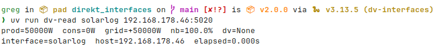

# Getting started

## Try it without installing

```bash
uvx --from dv-interfaces dv-detect 192.168.1.100
uvx --from dv-interfaces dv-read solarlog 192.168.1.100
```



## Installation

```bash
uv add dv-interfaces
```

Or with pip:

```bash
pip install dv-interfaces
```

Requires Python 3.10+ and a device reachable over TCP on port 502 (or whichever port you configure).

---

## First read

```python
from dv_interfaces import get_interface

with get_interface('solarlog', '192.168.1.100') as iface:
    ds = iface.read_dataset()

print(ds.production)   # e.g. 5000  (watts)
print(ds.consumption)  # e.g. 1200  (watts)
print(ds.grid_feed)    # e.g. 3800  (positive = feeding, negative = consuming)
```

The context manager calls `connect()` on entry and `disconnect()` on exit. The TCP socket is closed cleanly even if an exception is raised inside the block.

---

## Without a context manager

```python
iface = get_interface('solarlog', '192.168.1.100')
iface.connect()

try:
    ds = iface.read_dataset()
finally:
    iface.disconnect()
```

Every read method calls `_ensure_connected()` internally, so you do not need to call `connect()` explicitly before each read. If the socket drops between reads it reconnects automatically.

---

## Picking a driver name

Pass the driver name as the first argument to `get_interface`. Use `list_interfaces()` to see all available names at runtime:

```python
from dv_interfaces import list_interfaces

for entry in list_interfaces():
    print(entry['name'], '—', entry['description'])
# solarlog — SolarLog
# sma — SMA cluster
# meteocontrol — Meteocontrol blue'Log XC
# smartdog — ecodata SmartDog
```

---

## Health check

Before reading data, verify the device is reachable:

```python
iface = get_interface('solarlog', '192.168.1.100')

if iface.ping():
    with iface:
        ds = iface.read_dataset()
else:
    print('device unreachable')
```

`ping()` returns `True` if a TCP connection can be established. It never raises — all exceptions are caught and `False` is returned.

---

## Reading with metadata

`read_dataset_result()` wraps the dataset with timing and identity metadata, designed for polling tasks and direct database writes:

```python
from dv_interfaces import get_interface

with get_interface('solarlog', '192.168.1.100') as iface:
    result = iface.read_dataset_result()

print(result.interface)   # 'solarlog'
print(result.host)        # '192.168.1.100'
print(result.elapsed_s)   # 0.043
print(result.read_at)     # datetime (UTC)

# Flat dict for DB insertion or task queue result backend
row = result.to_dict()
print(row)
```

See [Reading data](reading.md) for the full field reference.

---

## Polling loop

For a continuous polling loop, use the `stream()` utility:

```python
from dv_interfaces import get_interface, stream
import logging

logger = logging.getLogger(__name__)

with get_interface('solarlog', '192.168.1.100') as iface:
    for result in stream(iface, interval_s=60):
        if isinstance(result, Exception):
            logger.error('read failed: %s', result)
            continue
        logger.info('read: %s', result.to_dict())
```

`stream()` catches exceptions from failed reads and yields them instead of crashing the loop. See [Streaming & utilities](streaming.md) for more patterns including finite reads and batch collection.
