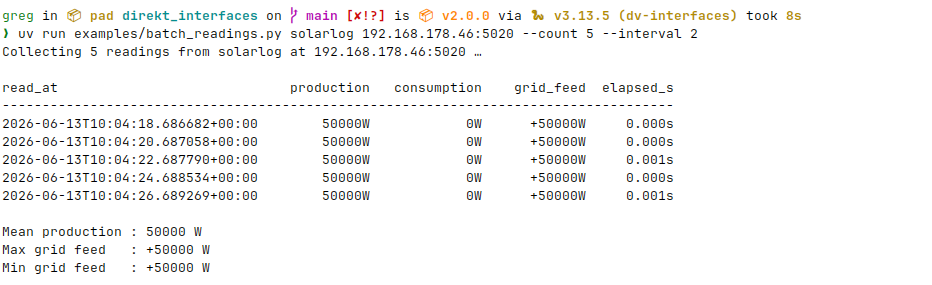

# Streaming & utilities

## stream()

`stream(iface, interval_s=0.0)` is a generator that yields `DVReadResult` objects continuously. When a read fails, the exception is yielded instead of raised — the loop keeps running.

```python
from dv_interfaces import get_interface, stream
import logging

logger = logging.getLogger(__name__)

with get_interface('solarlog', '192.168.1.100') as iface:
    for result in stream(iface, interval_s=60):
        if isinstance(result, Exception):
            logger.error('read failed: %s', result)
            continue
        logger.info('read: %s', result.to_dict())
```

`interval_s` is the wait between consecutive reads in seconds. Set to `0` (default) to read as fast as the device allows.

---

## Finite reads with islice

Stop after N readings without breaking the loop manually:

```python
from itertools import islice
from dv_interfaces import get_interface, stream

with get_interface('solarlog', '192.168.1.100') as iface:
    readings = list(islice(stream(iface, interval_s=5), 10))

successes = [r for r in readings if not isinstance(r, Exception)]
```

---

## Batch readings

Collect N readings into a plain list, then process them:

```python
from itertools import islice
from dv_interfaces import get_interface, stream

with get_interface('solarlog', '192.168.1.100') as iface:
    rows = [
        r.to_dict()
        for r in islice(stream(iface, interval_s=60), 100)
        if not isinstance(r, Exception)
    ]
```

See `examples/batch_readings.py` for a ready-to-run script that prints each reading as it arrives followed by a summary table.



---

## Live monitor

Print a one-line summary as each reading arrives:

```python
from dv_interfaces import get_interface, stream

with get_interface('solarlog', '192.168.1.100') as iface:
    for result in stream(iface, interval_s=10):
        if isinstance(result, Exception):
            print(f'ERROR: {result}')
        else:
            ds = result.dataset
            nb = f'{ds.limitation_nb_percent:.1f}%' if ds.limitation_nb_percent is not None else 'None'
            dv = f'{ds.limitation_dv_percent:.1f}%' if ds.limitation_dv_percent is not None else 'None'
            print(f'[{result.read_at:%H:%M:%S}] prod={ds.production}W  cons={ds.consumption}W  grid={ds.grid_feed:+d}W  nb={nb}  dv={dv}')
```

Output:

```
[08:12:33] prod=5000W  cons=1200W  grid=+3800W  nb=100.0%  dv=80.0%
[08:12:43] prod=4950W  cons=1210W  grid=+3740W  nb=100.0%  dv=80.0%
```

---

## Change detection with diff()

Only act when the plant state actually changes:

```python
from dv_interfaces import get_interface, stream
import logging

logger = logging.getLogger(__name__)

prev = None

with get_interface('solarlog', '192.168.1.100') as iface:
    for result in stream(iface, interval_s=30):
        if isinstance(result, Exception):
            logger.error(result)
            continue

        curr = result.dataset
        if prev is not None:
            changed = prev.diff(curr)
            if changed:
                logger.info('state changed: %s', changed)

        prev = curr
```
