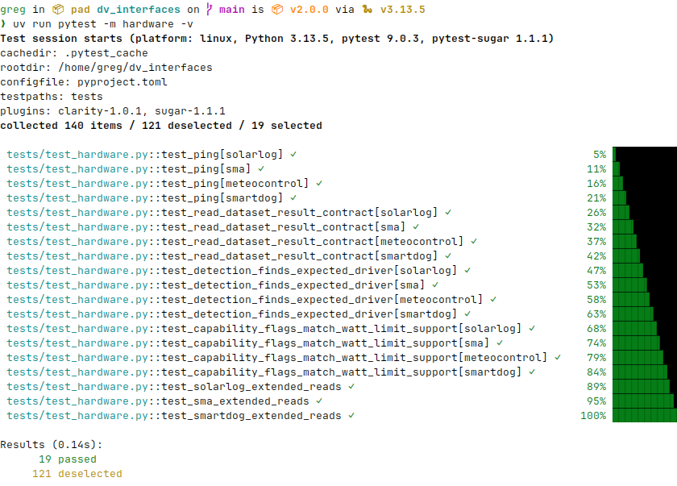

# Hardware testing

The test suite is split into two groups:

- **Unit tests** (`-m "not hardware"`) — run fully offline using mocks. These run in CI on every push.
- **Hardware tests** (`-m hardware`) — require real devices (or simulators) on the network. They are never run in CI and must be triggered manually.

## Running hardware tests



Set at least one `DV_TEST_<DRIVER>_HOST` environment variable, then run pytest with the `hardware` marker:

```bash
DV_TEST_SOLARLOG_HOST=192.168.1.100 uv run pytest -m hardware -v
```

Any driver whose host variable is not set is automatically skipped — you do not need to comment anything out.

Test multiple drivers at once by setting several variables:

```bash
DV_TEST_SOLARLOG_HOST=192.168.1.100 \
DV_TEST_SMA_HOST=192.168.1.101 \
DV_TEST_METEOCONTROL_HOST=192.168.1.102 \
DV_TEST_SMARTDOG_HOST=192.168.1.103 \
uv run pytest -m hardware -v
```

## Environment variables

### Required (one per driver)

| Variable | Driver |
|---|---|
| `DV_TEST_SOLARLOG_HOST` | SolarLog |
| `DV_TEST_SMA_HOST` | SMA |
| `DV_TEST_METEOCONTROL_HOST` | Meteocontrol |
| `DV_TEST_SMARTDOG_HOST` | SmartDog |

The value is the device hostname or IP address.

### Optional (per driver)

Each driver accepts optional overrides using the prefix `DV_TEST_<DRIVER>_`:

| Suffix | Type | Default | Description |
|---|---|---|---|
| `_PORT` | int | `502` | TCP port |
| `_SLAVE_ID` | int | driver default | Modbus slave ID |
| `_TIMEOUT` | float | `5.0` | Connection timeout in seconds |
| `_MAX_RETRIES` | int | `0` | Register-read retries before raising |
| `_RETRY_DELAY` | float | `0.2` | Seconds between retries |

Example — test SolarLog on a non-standard port with a 10 s timeout:

```bash
DV_TEST_SOLARLOG_HOST=192.168.1.100 \
DV_TEST_SOLARLOG_PORT=5020 \
DV_TEST_SOLARLOG_TIMEOUT=10.0 \
uv run pytest -m hardware -v
```

## Using a simulator

Any Modbus TCP simulator can substitute for real hardware. Point the host and port variables at the simulator's address and run as normal:

```bash
DV_TEST_SOLARLOG_HOST=127.0.0.1 DV_TEST_SOLARLOG_PORT=5020 \
DV_TEST_SMA_HOST=127.0.0.1 DV_TEST_SMA_PORT=5021 \
DV_TEST_METEOCONTROL_HOST=127.0.0.1 DV_TEST_METEOCONTROL_PORT=5022 \
DV_TEST_SMARTDOG_HOST=127.0.0.1 DV_TEST_SMARTDOG_PORT=5023 \
uv run pytest -m hardware -v
```

## What the tests cover

Each driver runs the same set of shared tests:

| Test | What it checks |
|---|---|
| `test_ping` | TCP connection succeeds and `ping()` returns `True` |
| `test_read_dataset_result_contract` | `read_dataset_result()` returns a valid `DVReadResult`; production and consumption are non-negative integers |
| `test_detection_finds_expected_driver` | `detect_interface()` identifies the correct driver on the expected port |
| `test_capability_flags_match_watt_limit_support` | `supports_dv_percent_limit` is `True`; `supports_dv_watt_limit` matches known per-driver capability |

Plus driver-specific extended tests:

| Test | Driver | What it checks |
|---|---|---|
| `test_solarlog_extended_reads` | SolarLog | `status()`, `read_possible_production_w()`, `read_battery_charge_w()`, `read_battery_discharge_w()` |
| `test_sma_extended_reads` | SMA | `read_grid_frequency_hz()` (45–65 Hz or `None`), `read_battery_soc_percent()` (0–100 or `None`) |
| `test_smartdog_extended_reads` | SmartDog | `read_limitation_dv_w()`, `read_battery_soc_percent()` |
